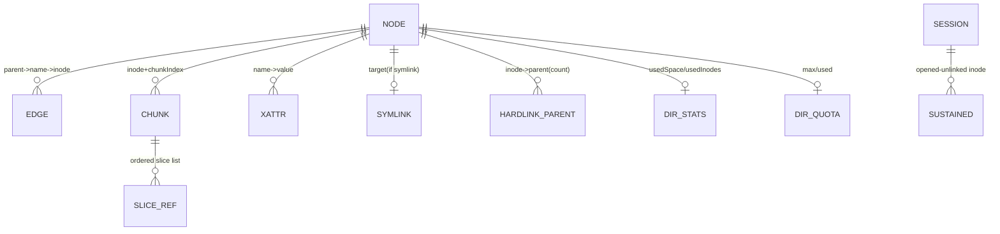
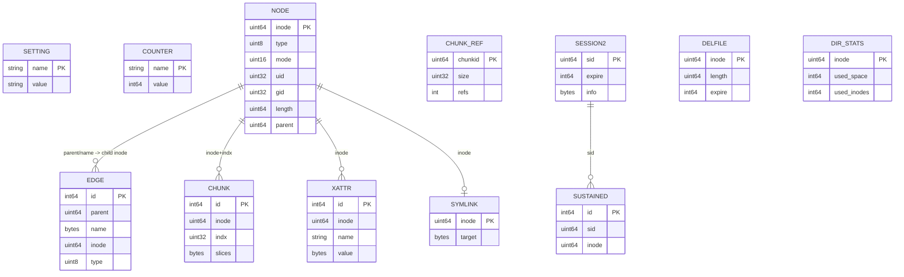
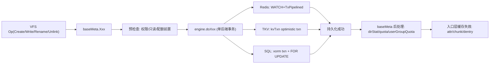
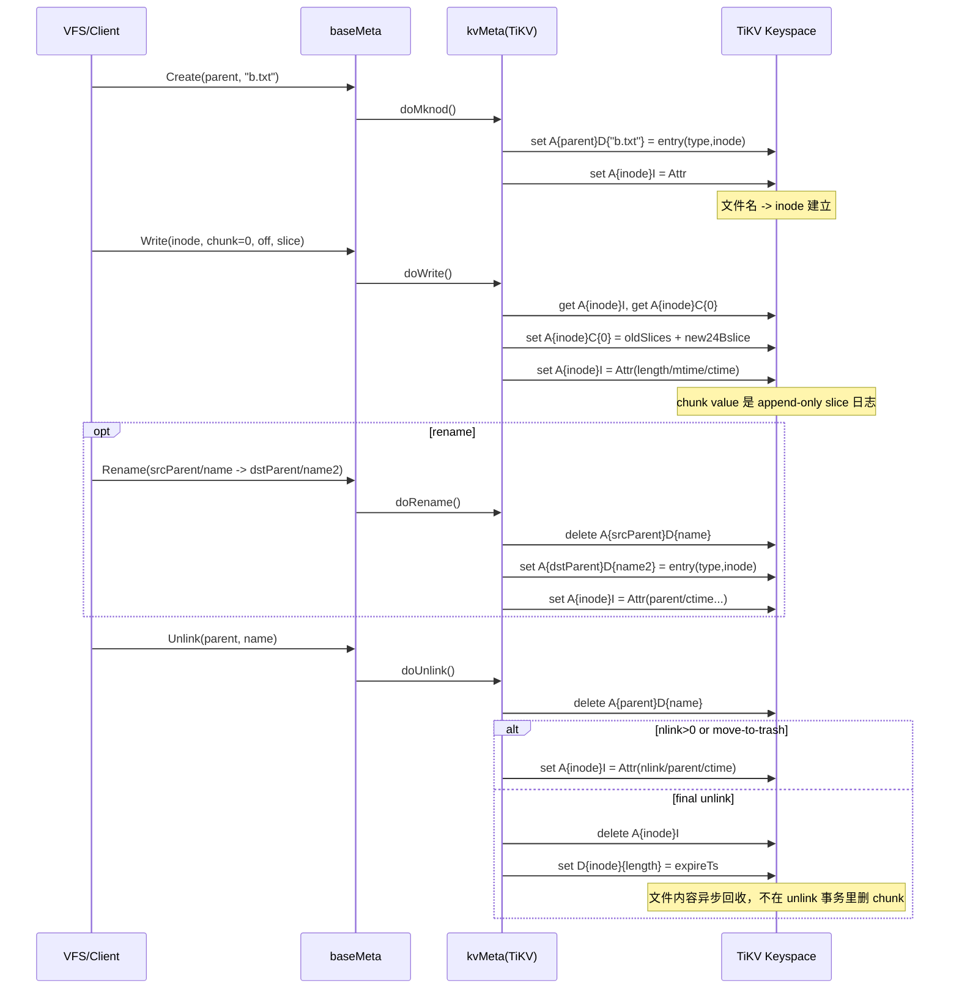
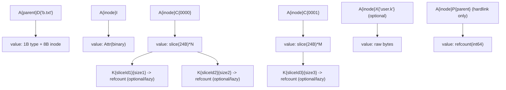
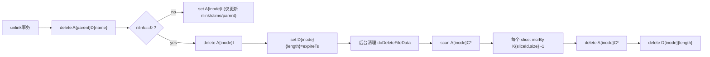
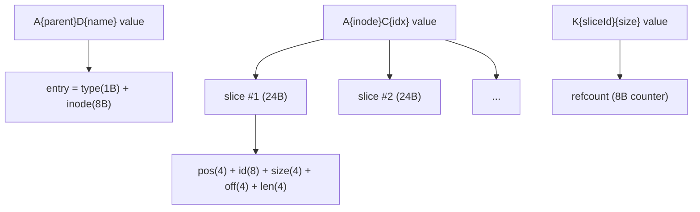
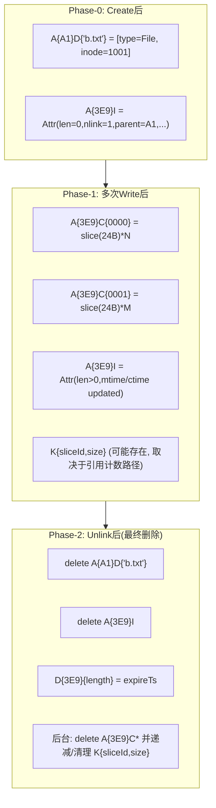

本文面向存储研发工程师，聚焦 `pkg/meta/base.go` 对应的 Meta 入口层（`Meta interface + baseMeta + engine`）。

目标不是概念介绍，而是回答工程问题：

1. 入口层如何把 POSIX 语义稳定地落在多种后端上；
2. 一次元数据请求在代码中如何流转，以及每一步为什么这么做；
3. 一致性、并发、缓存、统计、回收这些机制的约束和代价是什么。

---

## 1. 设计目标与非目标

### 1.1 设计目标

Meta 入口层的核心目标是 **语义收敛**，即把文件系统语义集中在一层实现，避免 Redis / SQL / TKV 各自定义语义。

对应代码：

- 对外统一接口：`pkg/meta/interface.go:371`
- 对后端统一契约：`pkg/meta/base.go:73`
- 语义执行器：`pkg/meta/base.go:265`

具体目标：

1. 为上层提供稳定 API：`Lookup/Rename/Read/Write/SetAttr/...`
2. 把权限、配额、缓存、统计、后台任务统一在 `baseMeta`
3. 后端只实现事务和持久化原语（`doXxx`）
4. 多后端行为尽量等价（错误码、边界行为、时序）

### 1.2 非目标

Meta 入口层不追求：

1. 把所有统计做成强一致实时值（统计与配额部分采用增量 + flush）
2. 消除所有冲突重试（而是通过轻量悲观锁 + 事务重试控制成本）
3. 完全后端无差异性能（语义一致，性能策略可差异）

---

## 2. 分层与契约

### 2.1 三层模型

1. `Meta interface`（上层契约）
2. `baseMeta`（语义编排层）
3. `engine` + 具体后端（执行层）

关键位置：

- `Meta`：`pkg/meta/interface.go:371`
- `engine`：`pkg/meta/base.go:73`
- `baseMeta`：`pkg/meta/base.go:265`

### 2.2 `Meta` 接口的语义域划分

`Meta interface` 实际可分 8 组：

1. 生命周期：`Init/Load/NewSession/CloseSession`
2. 命名空间：`Lookup/Mknod/Mkdir/Unlink/Rmdir/Rename/Link/Readdir`
3. 文件属性：`GetAttr/SetAttr/Access/Xattr/ACL`
4. 数据索引：`Read/NewSlice/Write/Truncate/Fallocate/CopyFileRange`
5. 锁与会话：`Flock/Getlk/Setlk/ListSessions/ListLocks`
6. 运维：`DumpMeta/LoadMeta/Check/CleanupTrash`
7. 配额：`HandleQuota/ScanUserGroupUsage/GetDirStat`
8. 扩展消息：`OnMsg/OnReload`

### 2.3 `engine` 的职责边界

`engine` 的 `doXxx` 并不是简单 DAO；它被要求提供“可事务提交的原子操作原语”，例如：

- `doRename`：必须在后端内原子完成边关系和属性修正
- `doWrite`：必须原子更新 inode 长度与 chunk slice 列表
- `doSetAttr`：必须处理权限与 suid/sgid 规则相关更新

因此 `baseMeta` 与 `engine` 是“策略层 + 原子执行层”的关系，而不是“service + crud”。

---

## 3. `baseMeta` 核心状态与不变量

`baseMeta` 字段很多（`pkg/meta/base.go:265`），工程上最重要的是以下状态组。

### 3.1 会话与生命周期状态

- `sid`：客户端会话 ID
- `sessCtx/sessWG`：后台任务生命周期控制
- `umounting`：优雅退出闸门

不变量：

1. `NewSession` 启动的后台协程必须由 `sessCtx` 可取消
2. `CloseSession` 必须 `Cancel + Wait` 后再返回

对应代码：

- `NewSession`：`pkg/meta/base.go:733`
- `CloseSession`：`pkg/meta/base.go:925`

### 3.2 并发控制状态

- `txlocks [1024]sync.Mutex`：inode hash 级别轻量悲观锁
- `openfiles` 内部锁：inode 级别读写串行化
- `compacting map`：同 chunk 压实去重

不变量：

1. 多 inode 事务加锁要排序，避免死锁（`txBatchLock`）
2. 同一 inode 的 chunk cache 更新与写入并发要受 `openFile` 锁保护

对应代码：

- `txBatchLock`：`pkg/meta/base.go:633`
- `Write/Truncate` 的 open-file 锁：`pkg/meta/base.go:2029`、`pkg/meta/base.go:2071`
- `compactChunk` 去重：`pkg/meta/base.go:2626`

### 3.3 缓存状态

- `of *openfiles`：attr + chunk slice 映射缓存
- `symlinks *symlinkCache`：符号链接目标缓存
- `aclCache`：ACL ID 到规则缓存

不变量：

1. 内容变化必须导致对应 chunk 缓存失效
2. 属性变化必须导致 attr 过期（避免 ACL/flags/sticky 旧值）

### 3.4 统计与配额状态

- `fsStat`：`usedSpace/usedInodes/newSpace/newInodes`
- `dirStats`：目录增量统计缓存
- `dirQuotas/userQuotas/groupQuotas`：配额镜像与增量

不变量：

1. 写路径成功后必须同步更新“逻辑增量”（即便后端刷盘是异步）
2. flush 成功后，增量与持久值归并

对应代码：

- stats：`pkg/meta/quota.go:252`、`pkg/meta/quota.go:266`
- quota flush：`pkg/meta/quota.go:544`

---

## 4. 请求处理模型：统一语义流水线

入口层典型请求流水线可以抽象为：

```text
参数校验
 -> inode 规范化(checkRoot)
 -> 权限校验(Access)
 -> 配额/容量校验(checkQuota)
 -> 缓存命中判断
 -> 后端原子原语(doXxx)
 -> 更新入口层状态(缓存/统计/配额/父链)
 -> 触发异步任务(compact/cleanup)
```

这个流水线在 `Lookup`、`Mknod`、`Write`、`Rename` 上都能看到。

---

## 5. 关键操作实现细节

### 5.1 Lookup：路径语义入口

代码：`pkg/meta/base.go:1141`

关键步骤：

1. 特殊名处理：`.`、`..`、`.trash`
2. 可选权限检查（父目录 `X` 权限）
3. 后端查 `doLookup`
4. 若 `CaseInsensi`，走 `resolveCase` 回退
5. 若命中目录，更新 `dirParents` 缓存

工程点：

- 把“路径语义”和“后端 key/schema 查找”解耦
- 大小写不敏感逻辑在入口层统一，不污染后端事务逻辑

### 5.2 Mknod/Create/Mkdir：创建语义

代码：`pkg/meta/base.go:1442`、`:1515`、`:1529`

关键步骤：

1. 只读、非法名字、保留名字（`.trash`）防护
2. `checkQuota` 先行，防止事务后回滚开销
3. `nextInode` 批量分配 inode（带预取）
4. 入口层组装 `Attr` 初值（目录 nlink=2、长度 4K）
5. 调 `doMknod`
6. 成功后更新：
   - `updateStats`
   - `updateDirStat`
   - `updateDirQuota`
   - `updateUserGroupQuota`

注意：`Create` 成功后会 `m.of.Open`，为后续读写准备缓存句柄。

### 5.3 Write：元数据写路径核心

入口代码：`pkg/meta/base.go:2027`

关键步骤：

1. 获取 inode 对应 `openFile` 锁，避免并发写/读错序
2. `defer InvalidateChunk(inode, indx)`，保证本 chunk 缓存失效
3. 调后端 `doWrite`
4. 成功后：
   - `updateParentStat`（目录空间/长度变化）
   - 用户组配额增量
   - 按阈值触发 `compactChunk`

`doWrite` 三后端对照：

- Redis：`RPUSH chunk list + SET inode + INCRBY usedSpace`（`pkg/meta/redis.go:2876`）
- SQL：`FOR UPDATE node + upsert chunk + slice_ref + update node`（`pkg/meta/sql.go:3070`）
- TKV：`txn get inode/chunk -> append slice -> set inode/chunk`（`pkg/meta/tkv.go:2302`）

工程点：

1. 入口层统一 quota 检查调用点，后端内部执行 check 所需父链读取
2. 入口层统一 compact 触发策略，后端只做 chunk 数据更新

### 5.4 Truncate/Fallocate：全 chunk 失效语义

- `Truncate`：`pkg/meta/base.go:2069`
- `Fallocate`：`pkg/meta/base.go:2092`

两者共同点：

1. 操作前加 inode open-file 锁
2. `defer InvalidateChunk(inode, invalidateAllChunks)`
3. `doTruncate/doFallocate` 成功后更新目录统计与配额

这体现了入口层统一的“结构性变更 -> 全 chunk 失效”规则。

### 5.5 Rename：复杂语义集中处理

入口代码：`pkg/meta/base.go:1741`

入口层负责：

1. flag 组合合法性
2. 跨配额域迁移预校验（目录场景可能走 summary）
3. 后端 `doRename` 调用
4. 根据返回 inode/target inode 调整目录父缓存、统计、配额

后端差异：

- Redis `doRename`：`WATCH` 多 key + `TxPipelined`（`pkg/meta/redis.go:2204`）
- SQL `doRename`：事务 + 行锁（`pkg/meta/sql.go:2110`）
- TKV `doRename`：KV 事务 + parentLocks（`pkg/meta/tkv.go:1833`）

工程意义：最复杂元语义（覆盖 replace/exchange/trash restore）在入口层收敛，避免后端实现发散。

---

## 6. 缓存语义：实现原理与失效规则

### 6.1 `openfiles` 缓存模型

代码：`pkg/meta/openfile.go:49`

缓存内容：

1. inode attr
2. chunk -> `[]Slice` 视图（`first` + `chunks`）

关键机制：

1. 新鲜度：`lastCheck + expire`
2. 引用计数：`refs`
3. 后台淘汰：超时或超限（`cleanup`）

命中路径：

- `GetAttr` -> `m.of.Check`（`pkg/meta/base.go:1319`）
- `Open` -> `m.of.OpenCheck`（`pkg/meta/base.go:1888`）
- `Read` -> `m.of.ReadChunk`（`pkg/meta/base.go:1958`）

### 6.2 统一失效规则（入口层）

1. `Write`：失效单 chunk（`pkg/meta/base.go:2037`）
2. `Truncate/Fallocate`：失效所有 chunk（`pkg/meta/base.go:2077`、`:2114`）
3. `SetAttr/SetFacl/Link`：attr-only 失效（`pkg/meta/base.go:1368`、`:3545`、`:1591`）
4. `compactChunk` 成功：失效被压实 chunk（`pkg/meta/base.go:2754`）

`invalidateAttrOnly` 的实现技巧：

- 常量定义为特殊 index（`0xFFFFFFFE`）
- 在 `InvalidateChunk` 中会落入“delete map key”分支，但统一执行 `lastCheck = 0`
- 结果是“强制 attr 回源”，而不是全量清 chunk

代码：`pkg/meta/openfile.go:9`、`:247`

### 6.3 KeepCache 与内核页缓存

`openfiles` 会根据 mtime 变化决定是否继承 `Attr.KeepCache`：

- mtime 未变：可以继续 keep cache
- mtime 变：失效 chunk cache

代码：`pkg/meta/openfile.go:137`、`:188`

FUSE 层消费这个语义：

- `entry.Attr.KeepCache == true` -> `FOPEN_KEEP_CACHE`
- 否则通知 inode cache 失效

代码：`pkg/fuse/fuse.go:241`

### 6.4 symlinkCache

代码：`pkg/meta/base.go:189`

- `ReadLink` 命中后直接返回
- `noatime=false` 时缓存会带 atime，便于判断是否需要更新 atime
- 无精确逐项失效，而是容量阈值触发定期批量清理

代码：`pkg/meta/base.go:1601`、`:250`

### 6.5 ACL 缓存

关键路径：

1. `NewSession` 阶段预热：`cacheACLs`（`pkg/meta/base.go:738`）
2. `GetFacl` 先尝试 `getFaclFromCache`（`pkg/meta/base.go:3551`）
3. miss 回源 `doGetFacl`
4. `SetFacl` 后执行 attr-only 失效

---

## 7. 并发控制机制

### 7.1 `txBatchLock`：入口层悲观锁

代码：`pkg/meta/base.go:633`

实现点：

1. inode 映射到 1024 槽
2. 多 inode 操作先排序再去重再加锁
3. 解决 Go mutex 不可重入问题

用于：Rename、跨目录操作等高冲突场景。

### 7.2 后端事务重试

三后端都支持最多 50 次重试：

- Redis：`pkg/meta/redis.go:1121`
- SQL：`pkg/meta/sql.go:1046`
- TKV：`pkg/meta/tkv.go:838`

重试由后端错误判定触发，入口层不关心具体重试细节。

### 7.3 open-file 局部锁

在 `Read/Write/Truncate/Fallocate/CopyFileRange` 等路径，会取 `openFile` 读写锁，避免 chunk cache 在并发更新中出现 torn state。

---

## 8. 一致性模型与故障语义

### 8.1 操作级一致性

单次元数据操作（例如 rename/write/truncate）依赖后端事务提供原子性。入口层在事务外做前置检查和后置状态更新。

### 8.2 统计/配额一致性

统计和配额并非所有后端都强同步：

- Redis：大量路径事务内直接更新计数，`doFlushStats` 空实现（`pkg/meta/redis.go:893`）
- SQL/TKV：入口层先记 `newSpace/newInodes`，后台 flush（`pkg/meta/sql.go:1279`、`pkg/meta/tkv.go:571`）

这意味着统计值可能存在短窗口“最终一致”。

### 8.3 超时与降级

`GetAttr` 对 Root/Trash 有超时保护，超时时返回兜底目录属性，优先保证挂载可用性。

代码：`pkg/meta/base.go:1326`

### 8.4 会话故障恢复

- 定时心跳刷新会话
- 清理 stale session
- `CloseSession` 时清理本地会话状态和后台协程

代码：`pkg/meta/base.go:839`、`:906`、`:925`

---

## 9. 后台任务与在线维护

入口层统一调度后台任务（`NewSession` 启动）：

1. flush stats
2. flush dir stat
3. flush quotas
4. cleanup deleted files
5. cleanup slices
6. cleanup trash
7. symlink cache clean

代码：`pkg/meta/base.go:767`

典型实现特征：

- 通过全局计数器 + `setIfSmall` 抢占执行权，避免多客户端重复做同一清理任务
- 任务运行有超时和抖动，减少集中冲突

---

## 10. 目录迭代器：大目录工程化处理

`DirHandler`（`pkg/meta/base.go:3561`）是入口层为大目录场景设计的统一抽象。

能力：

1. 分页 `List(offset)`
2. 遍历中本地 `Insert/Delete`
3. 光标推进和批次缓存

实现细节：`dirHandler` 在 `pkg/meta/base.go:3641`，通过 `dirFetcher` 把后端差异封装掉。

这对 `Clone`、批量删除、大目录扫描等场景非常关键，避免“全量加载目录项”的内存放大。

---

## 11. 观测与调优锚点

### 11.1 指标

关键指标初始化：

- 事务时延、操作时延、重试次数
- 容量与 inode 使用量
- 配额指标
- 后台任务时长与删除计数

代码：`pkg/meta/base.go:531`

### 11.2 关键配置项对行为的影响

`Config` 定义：`pkg/meta/config.go:37`

重点参数：

1. `OpenCache/OpenCacheLimit`：影响 attr/chunk 缓存命中与内存占用
2. `Heartbeat`：会话刷新与后台任务节奏
3. `FastStatfs`：statfs 读计数策略
4. `MaxDeletes`：删除对象并行度
5. `NoBGJob`：关闭后台任务
6. `ReadOnly`：所有写路径提前短路

---

## 12. 新后端接入的工程清单

新增元数据引擎时，建议按以下顺序实现：

1. 完整实现 `engine` 接口（先覆盖最小读写闭环）
2. 对齐事务重试语义（`txn`）
3. 对齐 `doRename/doWrite/doTruncate` 行为
4. 对齐配额与目录统计刷新语义
5. 跑跨后端一致性用例（重点 rename/hardlink/trash/quota）

高风险点：

1. rename 目标已存在与 exchange 分支
2. hardlink + parent 链统计
3. trash 与 delayed slice 清理时序
4. `invalidateAttrOnly` 对 ACL/flags 的传播

---

## 13. 结论（工程视角）

Meta 入口层的核心价值不在“包装 API”，而在 **集中承载文件系统语义与系统行为**。

它通过以下机制实现“多后端同语义”：

1. 统一入口流水线（校验/权限/配额/缓存/后处理）
2. 统一缓存失效规则
3. 统一并发控制骨架（悲观锁 + 后端重试）
4. 统一后台维护框架

对应代价也明确：`base.go` 体量大、策略集中、演进需严格回归测试。

如果以“可维护分布式元数据系统”标准评价，这是一套偏实战且可扩展的工程实现：语义一致性优先，性能优化通过缓存/批量/异步 flush 逐层叠加，而不是把复杂性分散到每个后端里。

---

## 14. 底层数据组织形式（系统化视图）

本节回答“Meta 数据在底层怎么存”的问题，按三层展开：

1. 与引擎无关的逻辑对象模型；
2. 关键二进制编码格式；
3. Redis / TKV / SQL 三类引擎的具体落盘组织。

### 14.1 引擎无关的逻辑对象模型

无论底层是 Redis、KV 还是 SQL，Meta 的核心对象关系基本一致：



可以把它理解成两条主线：

1. **命名空间主线**：`EDGE + NODE (+ HARDLINK_PARENT)`  
2. **数据索引主线**：`CHUNK + SLICE_REF`（Slice 列表是文件真实数据索引）

### 14.2 关键编码格式（跨引擎）

#### 14.2.1 `Attr` 编码

- 编码函数：`pkg/meta/interface.go:190`
- 解码函数：`pkg/meta/interface.go:218`

`Attr` 是 inode 的主元信息，序列化顺序固定：

1. `Flags(1B)`
2. `Typ+Mode(2B)`（高位存类型，低 12 位存 mode）
3. `Uid/Gid`
4. `Atime/Mtime/Ctime + nsec`
5. `Nlink/Length/Rdev/Parent`
6. 可选 `AccessACL/DefaultACL`

这个布局保证各后端都能按字节兼容地存/取 inode 元信息。

#### 14.2.2 Slice 编码

- `sliceBytes = 24`：`pkg/meta/slice.go:91`
- 编码：`marshalSlice`：`pkg/meta/slice.go:93`

每个 slice 记录是定长 24 字节：

`pos(4) + id(8) + size(4) + off(4) + len(4)`

`buildSlice` 会把同一 chunk 的“覆盖写历史”构造成最终逻辑视图（`pkg/meta/slice.go:135`）。

#### 14.2.3 其他常用编码

1. `entry`（目录项值，KV/TKV）  
`type(1B)+inode(8B)`，见 `pkg/meta/tkv.go:351`
2. `dirStat`（TKV）  
`length/space/inodes` 三个 int64，见 `pkg/meta/tkv.go:363`
3. `quota`（TKV）  
`MaxSpace/MaxInodes/UsedSpace/UsedInodes`，共 32B，见 `pkg/meta/tkv.go:376`
4. `quota`（Redis）  
常见为 `space+inodes` 两个 int64，16B，见 `pkg/meta/redis.go:763`

### 14.3 Redis 引擎：Key-Value + 容器类型组织

Redis 的结构注释在源码里已经给出（`pkg/meta/redis.go:57`），核心 key 构造函数在 `pkg/meta/redis.go:611` 到 `:760`。

#### 14.3.1 Redis keyspace 组织图

```mermaid
flowchart TD
    A["prefix + i$inode"] --> A1["String: Attr"]
    B["prefix + d$parent"] --> B1["Hash: name -> packed(type,inode)"]
    C["prefix + p$inode"] --> C1["Hash: parent -> count(hardlink)"]
    D["prefix + c$inode_$idx"] --> D1["List: 24B slice records"]
    E["prefix + x$inode"] --> E1["Hash: xattrName -> value"]
    F["prefix + s$inode"] --> F1["String: symlink target"]
    G["prefix + sliceRef"] --> G1["Hash: k$id_$size -> refcount"]
    H["prefix + allSessions"] --> H1["ZSet: sid -> expire"]
    I["prefix + sessionInfos"] --> I1["Hash: sid -> sessionInfo(json)"]
    J["prefix + session$sid"] --> J1["Set: sustained inodes"]
    K["prefix + delfiles"] --> K1["ZSet: inode:length -> expireTs"]
```



#### 14.3.2 Redis 关键点

1. **目录项是 Hash，不是独立 key**：`entryKey(parent)` -> `HSET name -> packedEntry`
2. **chunk 是 List**：追加写天然映射到 `RPUSH`
3. **slice 引用计数集中在一个 Hash（`sliceRef`）**，field 是 `k{id}_{size}`
4. **会话与待删文件用 ZSet**，利用 score 做过期扫描
5. **Cluster 模式前缀带 hash tag**：`prefix = "{db}"`，让关键 key 尽量落同槽（`pkg/meta/redis.go:276`）

### 14.4 TKV 引擎：前缀编码 Key 空间

TKV 的 key 规范在注释里定义得最系统（`pkg/meta/tkv.go:169`），key 构造函数见 `pkg/meta/tkv.go:203` 到 `:315`。

#### 14.4.1 TKV key 前缀树

```mermaid
flowchart TD
    K0["setting"] --> K0V["Format(JSON)"]
    K1["C*"] --> K1V["Counters"]
    K2["A{ino}I"] --> K2V["Attr(binary)"]
    K3["A{parent}D{name}"] --> K3V["Entry(type+inode)"]
    K4["A{ino}P{parent}"] --> K4V["Hardlink parent refcount"]
    K5["A{ino}C{idx}"] --> K5V["Slice list(bytes)"]
    K6["A{ino}S"] --> K6V["Symlink target"]
    K7["A{ino}X{name}"] --> K7V["Xattr value"]
    K8["K{id}{size}"] --> K8V["Slice refs"]
    K9["D{ino}{len}"] --> K9V["Deleted file tombstone"]
    K10["SE/SH/SI/SS"] --> K10V["Session subsystem"]
    K11["U/N/QD/QU/QG"] --> K11V["DirStat/Detached/Quota"]
    K12["R/KD"] --> K12V["ACL / Kerberos token"]
```



#### 14.4.2 TKV 关键点

1. `A*` 是 inode 主命名空间（inode、dentry、chunk、xattr 等）
2. 目录项值是 9B packed entry，inode 值是 `Attr` 二进制
3. chunk 值是连续拼接的 24B slice 数组
4. 配额在 TKV 中是单 key 保存四元组（max/used）

### 14.5 SQL 引擎：规范化表模型

SQL 模型定义在 `pkg/meta/sql.go:54` 到 `:263`。默认表前缀 `jfs_`（`pkg/meta/sql.go:449`）。

#### 14.5.1 SQL 核心表关系图



#### 14.5.2 SQL 关键点

1. `node/edge` 构成命名空间主结构（inode 树 + dentry）
2. `chunk.slices` 仍是 24B slice 序列，语义与 Redis/TKV 保持一致
3. `chunk_ref` 把对象引用计数拆成独立表，便于统计与清理
4. 会话从旧表 `session` 演进到 `session2`（带 expire）
5. 配额分 `dir_quota` 和 `user_group_quota`

### 14.6 三类引擎的“同构映射”对照

| 逻辑对象 | Redis | TKV | SQL |
| --- | --- | --- | --- |
| inode attr | `i$ino` String | `A{ino}I` | `node` |
| dentry | `d$parent` Hash | `A{parent}D{name}` | `edge` |
| hardlink parent ref | `p$ino` Hash | `A{ino}P{parent}` | `edge` 反查 + 计数 |
| chunk slice 列表 | `c$ino_$idx` List | `A{ino}C{idx}` bytes | `chunk.slices` |
| slice 引用计数 | `sliceRef` Hash | `K{id}{size}` | `chunk_ref` |
| xattr | `x$ino` Hash | `A{ino}X{name}` | `xattr` |
| symlink target | `s$ino` String | `A{ino}S` | `symlink` |
| session | `allSessions/sessionInfos` | `SE/SI/...` | `session2/sustained` |
| deleted file queue | `delfiles` ZSet | `D{ino}{len}` | `delfile` |
| dir stat / quota | 多个 Hash | `U/QD/QU/QG` | `dir_stats/dir_quota/user_group_quota` |

#### 14.6.1 各逻辑对象的含义与作用

| 逻辑对象 | 含义 | 作用（工程视角） | 关键约束/不变量 |
| --- | --- | --- | --- |
| inode attr | inode 的主元数据（类型、权限、uid/gid、时间戳、长度、nlink、parent 等） | 所有权限检查、时间戳更新、文件长度判定、链接计数变化都以它为准；是元数据事务的“主记录” | inode 存在性以它为准；`nlink==0` 后进入删除/回收路径；目录与文件类型不可混淆 |
| dentry | 命名空间边：`(parent,name) -> (type,inode)` | 支撑 `lookup/readdir/create/unlink/rename`；路径解析先查它 | 同一 `(parent,name)` 唯一；rename 的原子性本质是 dentry 迁移/交换 |
| hardlink parent ref | 硬链接父目录集合及计数（同一 inode 可能被多个 parent 引用） | 当 `attr.Parent==0`（多父）时，用它计算父目录传播（统计/配额/回收） | parent ref 计数与 `nlink` 变化要一致；unlink/rename/link 需同步维护 |
| chunk slice 列表 | 文件数据索引（按 `inode+chunkIndex` 存 slice 序列） | 读路径按它重建逻辑数据；写路径 append slice；compact 负责降碎片 | slice 记录编码固定（24B）；同 chunk 内“历史覆盖”需可重放 |
| slice 引用计数 | 对象分片（slice id,size）的全局引用数 | 驱动 GC 是否可删底层对象；支持 copy/compact 等共享分片场景 | 引用计数必须与 chunk/slice 实际引用收敛；允许延迟收敛但最终一致 |
| xattr | 扩展属性 `name->value` | 保存用户态/系统态附加元数据（含 ACL 相关扩展） | 随 inode 生命周期清理；键空间与普通 attr 解耦，避免大 value 干扰 inode 热路径 |
| symlink target | 符号链接目标路径 | symlink 的真实 payload，不放进普通 inode attr | 仅 `TypeSymlink` 使用；inode 删除时需联动删除 |
| session | 客户端会话与心跳、sustained inode 集合 | 解决“已 unlink 但仍 open”的语义：延迟回收，待 session 结束再删 | 会话过期后必须触发 sustained inode 清理，避免泄漏 |
| deleted file queue | 待删文件队列（inode,length,expire） | 把“命名空间删除”与“数据块清理”解耦，降低前台 unlink/rename 延迟 | 只表示待回收任务，不代表路径可见性；后台任务需幂等处理 |
| dir stat / quota | 目录统计与配额（目录级 + 用户/组级） | 快速做配额检查与增量更新，避免每次全树扫描 | 允许短时偏差但需可同步修正；不能长期与真实数据偏离 |

从入口层看，这 10 类对象可分为三组：

1. **命名空间一致性组**：`inode attr + dentry + hardlink parent ref`
2. **数据可达性与回收组**：`chunk slice 列表 + slice 引用计数 + deleted file queue + session`
3. **扩展与治理组**：`xattr + symlink target + dir stat/quota`

入口层 `baseMeta` 的核心职责，就是保证三组对象在跨引擎实现中保持同一套语义，而不是同一套物理结构。

### 14.7 从一个文件看三种落盘（示例）

假设创建并写入 `/a/b.txt`，抽象上都会产生：

1. `a`、`b.txt` 的 inode（attr）
2. `root->a`、`a->b.txt` 两条目录边
3. `b.txt` 的 chunk0 slice 列表
4. slice 引用计数

只是表现形态不同：

1. Redis：`i*`/`d*`/`c*` + `sliceRef` 容器组合
2. TKV：`A*` 前缀 key + `K*` 引用 key
3. SQL：`node/edge/chunk/chunk_ref` 多表事务更新

这也是 Meta 入口层存在的根本原因：**把统一语义固定在 `baseMeta`，把“组织形态差异”下沉到 `doXxx`**。

### 14.8 操作级“物理写集合”与事务边界

下面把入口层最关键的四个操作拆成“语义入口 -> 后端写集”，用于排障和容量评估时快速定位热 Key / 热表。

统一入口（语义层）：

1. `Mknod`：`pkg/meta/base.go:1453` -> `en.doMknod`
2. `Write`：`pkg/meta/base.go:2041` -> `en.doWrite`
3. `Unlink`：`pkg/meta/base.go:1648` -> `en.doUnlink`
4. `Rename`：`pkg/meta/base.go:1752` -> `en.doRename`

对应三类后端实现：

1. Redis：`pkg/meta/redis.go:1423` / `:2876` / `:1574` / `:2204`
2. TKV：`pkg/meta/tkv.go:1155` / `:2302` / `:1295` / `:1833`
3. SQL：`pkg/meta/sql.go:1624` / `:3070` / `:1789` / `:2110`

#### 14.8.1 Create/Mknod 写集

| 层次 | 关键写入 |
| --- | --- |
| Redis `doMknod` | `SET i$inode`（新 inode attr）；`HSET d$parent name->entry`（目录项）；可选 `SET i$parent`（父目录 mtime/nlink）；可选 `SET s$inode`（symlink）；目录时初始化 `dirUsed*`；全局 `usedSpace/totalInodes` 计数 |
| TKV `doMknod` | `set A{parent}D{name}`（entry）；`set A{inode}I`（attr）；可选 `set A{parent}I`；可选 `set A{inode}S`；目录时 `set U{inode}`（dirStat） |
| SQL `doMknod` | `insert edge(parent,name,inode,type)`；`insert node(inode,...)`；可选 `insert symlink`；目录时 `insert dir_stats`；可选 `update parent node`（nlink/mtime/ctime） |

工程要点：入口层在成功后统一做配额/统计传播（`updateDirStat/updateDirQuota/updateUserGroupQuota`），见 `pkg/meta/base.go:1509` 之后。

#### 14.8.2 Write 写集

| 层次 | 关键写入 |
| --- | --- |
| Redis `doWrite` | `RPUSH c$inode_$idx <24B slice>`；`SET i$inode`（length/mtime/ctime）；可选 `INCR usedSpace` |
| TKV `doWrite` | 读改写 `A{inode}C{idx}`（把 24B slice 追加到 bytes 尾部）；`set A{inode}I` |
| SQL `doWrite` | `upsert chunk(inode,idx,slices)`；`insert/upsert chunk_ref(chunkid,size,refs)`；`update node.length/mtime/ctime` |

工程要点：

1. 写成功后入口层统一更新父目录统计和 user/group quota，见 `pkg/meta/base.go:2062`。
2. 入口层在返回前失效 chunk 缓存：`InvalidateChunk(inode, indx)`，见 `pkg/meta/base.go:2051`。
3. Slice 引用计数不是所有引擎都在 `doWrite` 即时维护：Redis 路径里该增量在此处是注释状态（`pkg/meta/redis.go:2907`），TKV 多在 compact/cleanup 过程调账，SQL 在写路径即更新 `chunk_ref`。

#### 14.8.3 Unlink 写集

| 层次 | 关键写入 |
| --- | --- |
| Redis `doUnlink` | `HDEL d$parent name`；可选更新 `i$parent`；目标 inode 若仍存活则 `SET i$inode`（nlink/ctime/parent），否则删除 `i$inode/x$inode` 并可能进入 `delfiles` 或 `sustained` 路径；目录相关统计 hash 清理 |
| TKV `doUnlink` | `delete A{parent}D{name}`；可选 `set A{parent}I`；若回收则 `delete A{inode}I` + `delete A{inode}X*`，若进 trash 则回写 inode 并新增 trash entry |
| SQL `doUnlink` | `delete edge(parent,name)`；按 nlink/trash 状态更新或删除 `node`；可选 `insert delfile` / `insert sustained`；可选 `delete symlink`；`delete xattr` |

工程要点：入口层统一做目录统计/配额扣减（`pkg/meta/base.go:1661` 之后），并通过 open-file 语义决定“延迟删”还是“立即删”。

#### 14.8.4 Rename 写集

| 层次 | 关键写入 |
| --- | --- |
| Redis `doRename` | 源目录 `HDEL` + 目标目录 `HSET`；被覆盖目标按 trash/overwrite/exchange 分支更新或删除 inode；必要时更新 `p$inode` 硬链父引用；可选 `delfiles/sustained` |
| TKV `doRename` | 源 `delete A{srcParent}D{nameSrc}` + 目标 `set A{dstParent}D{nameDst}`；被覆盖目标 inode 走 trash/删除/保留分支；必要时更新 `A{ino}P{parent}` 计数；可选 `D{ino}{len}`/`SS{sid}{ino}` |
| SQL `doRename` | `delete/insert edge` 或 exchange 双向 update；更新 source/target inode 的 `parent/nlink/ctime`；覆盖删除分支落 `delfile/sustained`；可选清理 `xattr/symlink/dir_quota` |

工程要点：入口层统一处理跨目录 rename 的 quota 搬移与目录统计对冲（`pkg/meta/base.go:1798` 之后）。

#### 14.8.5 操作到写集的统一流程图



### 14.9 底层一致性关注点（面向工程排障）

#### 14.9.1 为什么入口层必须统一“后处理”

后端 `doXxx` 主要负责“命名空间与 inode/chunk 的原子落库”，但目录统计、配额、用户组配额、缓存失效都在入口层统一做，目的是：

1. 不把统计/缓存策略耦合到每个后端；
2. 避免三套后端实现出现语义漂移；
3. 允许后端仅关注事务写集与冲突重试。

#### 14.9.2 调试时的最小闭环

当出现“目录大小不对 / 文件可见但读不到 / rename 后旧路径偶现”时，建议按固定顺序检查：

1. `baseMeta` 是否执行到后处理（`updateParentStat`、`updateDirQuota`、`InvalidateChunk` 等）。
2. 对应后端 `doXxx` 是否完整提交（Redis key、TKV key、SQL 行是否都落盘）。
3. 是否命中 trash/sustained/delfile 分支（尤其是打开文件被删除、覆盖 rename）。

这三步能把问题快速归因为“语义层缺失”还是“存储形态差异导致的实现缺口”。

## 15. TiKV 文件视角：一个文件在 Meta 持久化中的组织形式

本节只讨论 TiKV（`pkg/meta/tkv.go`），且只从“一个文件 inode”的生命周期看底层数据组织。

### 15.1 先看结论：一个文件会落哪些 key

以文件 `parent=/a`，`name=b.txt`，`inode=1001` 为例，稳定态通常包含：

1. `A{1001}I`：文件 inode 的 `Attr` 二进制（`inodeKey`，`pkg/meta/tkv.go:203`）
2. `A{parent}D{"b.txt"}`：目录项，value 为 `type+inode`（`entryKey`，`pkg/meta/tkv.go:207`）
3. `A{1001}C{chunkIndex}`：每个 chunk 的 slice 列表（`chunkKey`，`pkg/meta/tkv.go:215`）
4. `K{sliceId}{size}`：对象分片引用计数（按路径懒创建，不是每次 `doWrite` 都立即出现，`sliceKey`，`pkg/meta/tkv.go:219`）
5. `A{1001}X{name}`：扩展属性（可选，`xattrKey`，`pkg/meta/tkv.go:231`）
6. `A{1001}P{parent}`：仅硬链接时出现，记录 parent 引用计数（`parentKey`，`pkg/meta/tkv.go:211`）

### 15.2 文件生命周期时序图（TiKV）



### 15.3 稳态结构图（单文件）



### 15.4 删除与回收结构图（单文件）

`unlink` 只处理命名空间和 inode；真实 chunk/slice 回收走异步。



对应实现点：

1. `doUnlink` 里写 `D{inode}{length}`：`pkg/meta/tkv.go:1422`
2. 扫描待删文件：`doFindDeletedFiles`，`pkg/meta/tkv.go:2587`
3. 真正删 chunk/slice：`doDeleteFileData`，`pkg/meta/tkv.go:2670`
4. chunk 删除时回收 slice 引用：`deleteChunk`，`pkg/meta/tkv.go:2632`

### 15.5 value 二进制组织（文件相关）



关键实现：

1. `entry` 编解码：`packEntry/parseEntry`，`pkg/meta/tkv.go:351`
2. chunk slice 记录长度：`sliceBytes=24`，`pkg/meta/slice.go:91`
3. slice 编码：`marshalSlice`，`pkg/meta/slice.go:93`

### 15.6 一个文件的“最小可用集合”

对 TiKV 来说，文件可读写最小集合是：

1. `A{inode}I`（没有它文件不存在）
2. `A{parent}D{name}`（没有它路径不可达）
3. `A{inode}C*`（可为空；空表示空文件或洞文件）

`K{sliceId}{size}` 是 GC/回收正确性的关键，不是路径解析必需键；  
`D{inode}{length}` 是延迟删除队列键，不是在线访问键。

### 15.7 具体样例快照（单文件）

假设：

1. `parent inode = 0x00000000000000A1`
2. `file inode = 0x00000000000003E9`（十进制 1001）
3. 写入了两个 chunk：`idx=0`、`idx=1`


